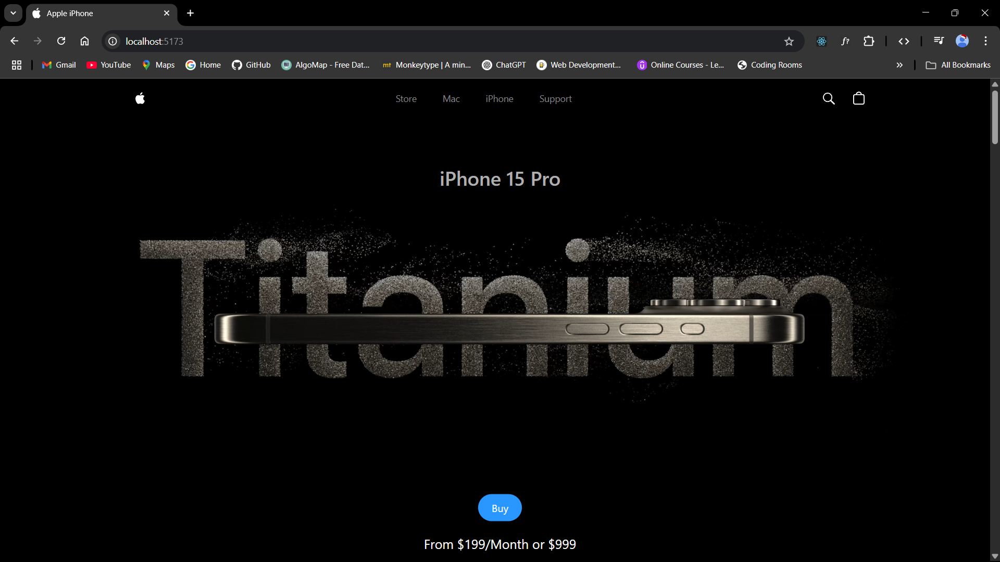
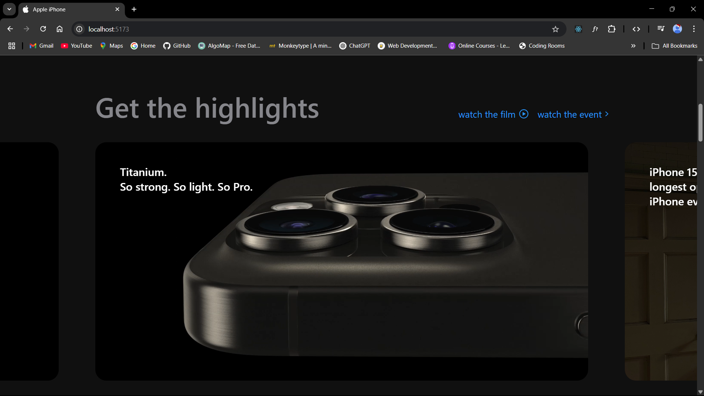
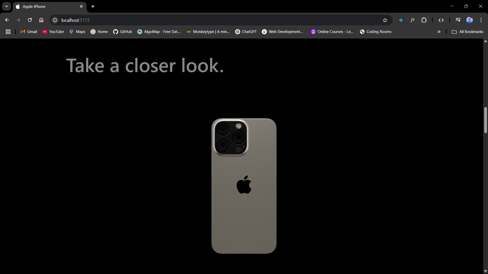

# Apple Website Clone – iPhone 15 Pro Edition

A stunning, responsive clone of the official Apple website highlighting the **iPhone 15 Pro**. Built using modern web technologies like **React**, **Tailwind CSS**, **GSAP**, and **Three.js**, this project demonstrates high-quality frontend engineering, interactive animations, and immersive 3D experiences.

---

## ✨ Features

- 🔁 **Fully Responsive** – Optimized for desktops, tablets, and mobile devices.
- 🎞️ **Scroll-based Animations** – Smooth transitions powered by **GSAP + ScrollTrigger**.
- 📱 **Interactive 3D Models** – Realistic 3D render of the iPhone 15 Pro using **Three.js**.
- 🎥 **Video Carousel** – Engaging multimedia experience for product highlights.
- ⚙️ **Modular Components** – Reusable and scalable React components.
- 🎨 **Tailored Styling** – Built with **Tailwind CSS** and custom CSS variables for design precision.

---


## 🌐 Live Demo

[Apple website](https://apple-website-seven-nu.vercel.app)

---

## 🛠️ Tech Stack

| Technology      | Purpose                             |
|-----------------|-------------------------------------|
| **React**       | UI and component-based structure    |
| **Tailwind CSS**| Styling using utility-first classes |
| **GSAP**        | Animations and scroll effects       |
| **Three.js**    | 3D rendering of the iPhone model    |
| **Vite**        | Fast bundling and dev server        |
| **Styled Components** | Scoped component styling       |

---

## 🖼️ Screenshots

### Hero Section


### Video Caraosel


### 3D Model


---
## 📁 Project Structure

```
apple-website-clone/
├── public/                  # Images, videos, 3D models
├── src/
│   ├── constants/              
│   ├── components/          # Modular React components
│   ├── utils/               
│   ├── index.css              # Tailwind and custom styles
│   └── App.jsx              # Main component
├── tailwind.config.js       # Tailwind setup
├── vite.config.js           # Vite configuration
└── README.md                # Project documentation
```

---

## 🔧 Installation

Follow these steps to run the project locally:

```bash
# 1. Clone the repository
git clone https://github.com/Ritesh2080/apple-website.git

# 2. Navigate to the project folder
cd apple-website-clone

# 3. Install dependencies
npm install

# 4. Start the development server
npm run dev
```

> The app will be available at: **http://localhost:5173**

---


## 🧩 Key Components

- **Navbar** – Top navigation with Apple-style icons.
- **Hero** – Full-screen video background with CTAs.
- **Highlight** – Section with GSAP-driven animations.
- **Model** – 3D iPhone 15 Pro model using Three.js.
- **Features** – Details on camera, battery, display, etc.
- **How It Works** – A17 Pro chip explanation with scroll animations.
- **Footer** – Footer navigation and credits.

---

## 📜 License

This project is licensed under the [MIT License](LICENSE).

---

## 🙏 Acknowledgments

- **Apple Inc.** – Design inspiration and product imagery.
- **GSAP** – For powerful animation tools.
- **Three.js** – For enabling stunning 3D experiences.
- **Tailwind CSS** – For fast, flexible UI styling.
- **ChatGPT** - For creating README.
- **[JavaScript Mastery](https://youtu.be/kRQbRAJ4-Fs?si=QsgPzoY39XDpwS8k)** - For the tutorial.

---

## 💡 Want to Contribute?

Contributions, issues, and feature requests are welcome!  
Feel free to fork the repository and submit a pull request.
